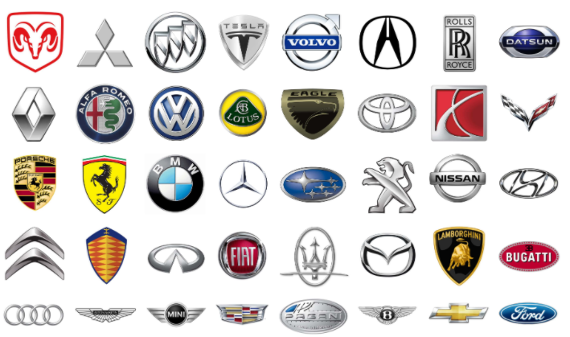

## Predict automobile price using Machine Learning

Data Provided by : https://www.kaggle.com/goyalshalini93/car-data

Use Machine learning to predict the price of a car based on several characteristics. The objective is to
build a model to understand the factors that drive the car of the price. This will help your automobile
company launch their new car in the market effectively by pricing it better.

#### Data description:

Attribute: Attribute Range
1. symboling: -3, -2, -1, 0, 1, 2, 3
(Cars are initially assigned a risk factor symbol associated with its price. Then, if it is more risky (or less),
this symbol is adjusted by moving it up (or down) the scale. Actuarians call this process "symboling". A
value of +3 indicates that the auto is risky, -3 that it is probably pretty safe.)
2. make: alfa-romero, audi, bmw, chevrolet, dodge, honda, isuzu, jaguar, mazda, mercedes- benz,
mercury, mitsubishi, nissan, peugot, plymouth, porsche, renault, saab, subaru, toyota, volkswagen,
volvo
3. fuel-type: diesel, gas.
4. aspiration: std, turbo.
5. num-of-doors: four, two.
6. body-style: hardtop, wagon, sedan, hatchback, convertible.
7. drive-wheels: 4wd, fwd, rwd.
8. engine-location: front, rear.
9. wheel-base: continuous from 86.6 120.9.
10. length: continuous from 141.1 to 208.1. 11
width: continuous from 60.3 to 72.3.
12. height: continuous from 47.8 to 59.8.
13. curb-weight: continuous from 1488 to 4066.
14. engine-type: dohc, dohcv, l, ohc, ohcf, ohcv, rotor.
15. num-of-cylinders: eight, five, four, six, three, twelve, two.
16. engine-size: continuous from 61 to 326.
17. fuel-system: 1bbl, 2bbl, 4bbl, idi, mfi, mpfi, spdi, spfi.
18. bore: continuous from 2.54 to 3.94.
19. stroke: continuous from 2.07 to 4.17.
20. compression-ratio: continuous from 7 to 23.
21. horsepower: continuous from 48 to 288

## Objective
Use Machine learning to predict the price of a car based on several characteristics. The objective is to build a model to understand the factors that drive the car of the price. This will help your automobile company launch their new car in the market effectively by pricing it better.

## Correlation matrix

## Without Feature selection 

From the above graphs we find:

R sqaure for test data peaks at 13 features and at this point model generalises well as train R2 is v close to test. Train R2 keep on increasing beyond 13 features but R2 keeps increasing as you add more features to train data. We have select number of features where model accuracy and generalization both are at satisfactory level.
RMSE for test data is lowest at 13 features and beyond that it increases. Train RMSE at 13 also looks good, adding more features to train decreases RMSE but again there is always a trade off between removing features (aka reducing complexity) and model performance. So we will go with 13 features.

## Modelling the Data & Evaluation + Feature selection

From the graph, we see that the error is higher when k value goes beyind 4. RMSE is in the lower range when k < 4. Based on this observation, I choose k=3 and these four variables (enginesize, horsepower, carwidth) for an optimal model for deciding the price of the cars.

